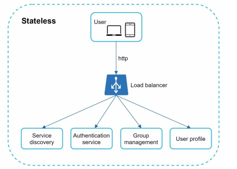
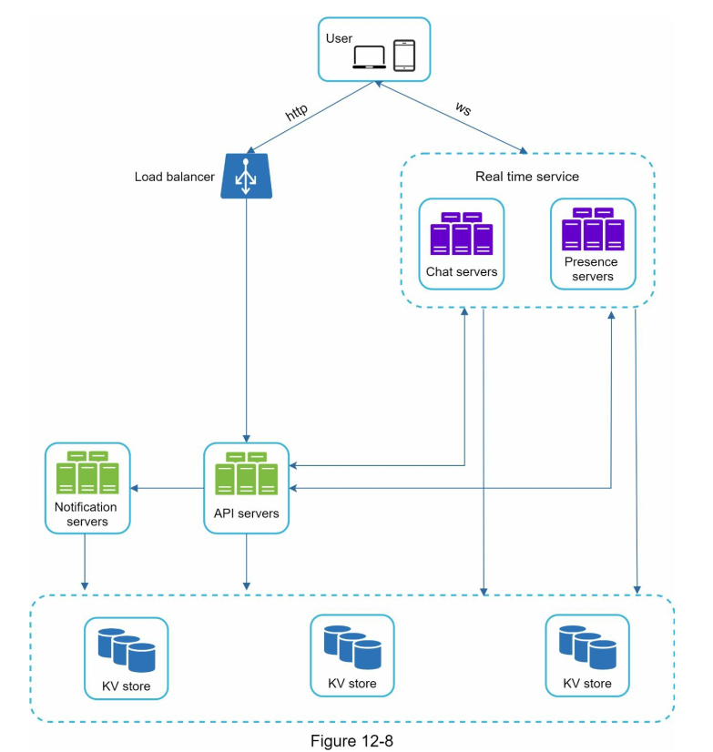

# 12 Design a chat system on system design vol 1

## Chương 12: Thiết kế hệ thống trò chuyện

Trong chương này, chúng ta sẽ khám phá việc thiết kế một `chat system`. Hầu hết mọi người đều sử dụng ứng dụng trò chuyện. Hình 12-1 cho thấy một số ứng dụng phổ biến nhất trên thị trường.

Một ứng dụng chat thực hiện các chức năng khác nhau cho từng người dùng. Việc xác định chính xác yêu cầu là cực kỳ quan trọng. Ví dụ, bạn không muốn thiết kế một hệ thống tập trung vào trò chuyện nhóm khi người phỏng vấn lại đang nghĩ đến trò chuyện một đối một. Việc khám phá các yêu cầu tính năng là rất quan trọng.

### Bước 1 - Hiểu vấn đề và xác định phạm vi thiết kế

Điều quan trọng là phải thống nhất loại ứng dụng trò chuyện cần thiết kế. Trên thị trường có các ứng dụng trò chuyện `một đối một` như Facebook Messenger, WeChat, WhatsApp, các ứng dụng trò chuyện văn phòng tập trung vào `trò chuyện nhóm` như Slack, hoặc các ứng dụng trò chuyện game như Discord, `tập trung vào tương tác nhóm lớn và độ trễ âm thanh thấp.`

Nhóm câu hỏi đầu tiên cần làm rõ chính là xác định chính xác những gì mà người phỏng vấn muốn khi yêu cầu bạn thiết kế một hệ thống trò chuyện. Ít nhất, bạn cần xác định xem bạn nên tập trung vào ứng dụng trò chuyện một đối một hay trò chuyện nhóm. Một số câu hỏi bạn có thể hỏi như sau:

- `Candidate:` Chúng ta sẽ thiết kế ứng dụng trò chuyện loại nào? Một đối một hay dựa trên nhóm?
- `Interviewer:` Nó phải hỗ trợ cả trò chuyện một đối một và trò chuyện nhóm.

- `Candidate:` Đây là ứng dụng di động? Hay là ứng dụng web? Hay cả hai?
- `Interviewer:` Cả hai.

- `Candidate:` Quy mô của ứng dụng này là gì? Một ứng dụng khởi nghiệp hay quy mô lớn?
- `Interviewer:` Nó phải hỗ trợ 50 triệu người dùng hoạt động hàng ngày (DAU).

- `Candidate:` Đối với trò chuyện nhóm, giới hạn số người trong nhóm là bao nhiêu?
- `Interviewer:` Tối đa 100 người.

- `Candidate:` Các tính năng nào quan trọng đối với ứng dụng trò chuyện? Nó có hỗ trợ đính kèm file không?
- `Interviewer:` Trò chuyện một đối một, trò chuyện nhóm, chỉ báo trạng thái trực tuyến. Hệ thống chỉ hỗ trợ tin nhắn văn bản.

- `Candidate:` Có giới hạn kích thước tin nhắn không?
- `Interviewer:` Có, chiều dài tin nhắn không được vượt quá 100.000 ký tự.

- `Candidate:` Mã hóa đầu cuối có bắt buộc không?
- `Interviewer:` Không yêu cầu ngay bây giờ nhưng chúng ta sẽ thảo luận nếu có thời gian.

- `Candidate:` Chúng ta sẽ lưu trữ lịch sử trò chuyện trong bao lâu?
- `Interviewer:` Mãi mãi.

Trong chương này, chúng ta sẽ tập trung vào việc thiết kế một ứng dụng trò chuyện giống như Facebook Messenger, với các tính năng sau:

- Trò chuyện một đối một với `độ trễ thấp`
- Trò chuyện nhóm nhỏ (tối đa `100 người`)
- Trạng thái `trực tuyến`
- Hỗ trợ `nhiều thiết bị`. Cùng một tài khoản có thể đăng nhập trên `nhiều thiết bị cùng lúc.`
- Thông báo `đẩy`.
  Cũng quan trọng là phải thống nhất về quy mô thiết kế. Chúng ta sẽ thiết kế một hệ thống hỗ trợ 50 triệu DAU.

---

### Bước 2 - Đề xuất thiết kế tổng thể và nhận sự đồng thuận

Để phát triển một thiết kế chất lượng, `chúng ta cần có kiến thức cơ bản về cách các client và server giao tiếp với nhau`. Trong chat system, các client có thể là ứng dụng di động hoặc ứng dụng web. Các client không giao tiếp trực tiếp với nhau. Thay vào đó, mỗi client kết nối với một `chat service`, dịch vụ này hỗ trợ tất cả các tính năng đã đề cập ở trên. Chúng ta sẽ tập trung vào các thao tác cơ bản. `Chat service` phải hỗ trợ các chức năng sau:

- Nhận tin nhắn từ các client khác.
- Tìm kiếm người nhận phù hợp cho mỗi tin nhắn và chuyển tiếp tin nhắn đến người nhận.
- Nếu người nhận không trực tuyến, giữ tin nhắn cho người nhận đó trên server cho đến khi họ trực tuyến.

Hình 12-2 cho thấy mối quan hệ giữa các client (người gửi và người nhận) và `chat service`.

Khi một client muốn bắt đầu trò chuyện, nó kết nối với `chat service` qua một hoặc nhiều giao thức mạng. Đối với `chat service`, việc lựa chọn giao thức mạng là rất quan trọng. Hãy thảo luận điều này với người phỏng vấn.

Các yêu cầu chủ yếu được khởi tạo bởi client trong hầu hết các ứng dụng client/server. Điều này cũng đúng với phía người gửi trong ứng dụng trò chuyện. Trong Hình 12-2, khi người gửi gửi một tin nhắn đến người nhận qua `chat service`, họ sử dụng giao thức HTTP, một giao thức web phổ biến nhất. Trong kịch bản này, client mở một kết nối HTTP với `chat service` và gửi tin nhắn, thông báo dịch vụ gửi tin nhắn cho người nhận. Keep-alive rất hiệu quả trong trường hợp này vì tiêu đề keep-alive cho phép client duy trì một kết nối liên tục với `chat service`. Nó cũng giảm số lượng các bước bắt tay TCP. HTTP là một lựa chọn tốt cho phía người gửi, và nhiều ứng dụng trò chuyện phổ biến như Facebook đã sử dụng HTTP ban đầu để gửi tin nhắn.

Tuy nhiên, phía người nhận có một chút phức tạp hơn. Vì HTTP là giao thức khởi tạo từ phía client, việc gửi tin nhắn từ server không phải là điều đơn giản. Qua nhiều năm, đã có nhiều kỹ thuật được sử dụng để giả lập kết nối từ server: polling, long polling và WebSocket. Những kỹ thuật này rất quan trọng và thường được sử dụng trong các cuộc phỏng vấn thiết kế hệ thống, vì vậy chúng ta sẽ xem xét từng kỹ thuật một.

`Polling`
Như trong Hình 12-3, polling là một kỹ thuật mà client sẽ định kỳ hỏi server xem có tin nhắn nào có sẵn không. Tùy theo tần suất polling, polling có thể tốn kém và tiêu tốn tài nguyên server vì thường không có tin nhắn nào cần trả lời.

`Long polling`  
Vì polling có thể không hiệu quả, tiến triển tiếp theo là long polling (Hình 12-4).

Trong long polling, client giữ kết nối mở cho đến khi có tin nhắn mới hoặc đạt ngưỡng thời gian timeout. Khi client nhận được tin nhắn mới, nó lập tức gửi một yêu cầu khác tới server, bắt đầu lại quá trình. Long polling có một số nhược điểm:

- Người gửi và người nhận có thể không kết nối với cùng một server trò chuyện. Các server dựa trên HTTP thường không có trạng thái. Nếu sử dụng cân bằng tải vòng (round robin), server nhận tin nhắn có thể không có kết nối long polling với client nhận tin nhắn.
- Server không có cách tốt để biết liệu một client đã ngắt kết nối.
- Nó không hiệu quả. Nếu người dùng không trò chuyện nhiều, long polling vẫn sẽ tạo kết nối định kỳ sau các lần timeout.

`WebSocket` là giải pháp phổ biến nhất để gửi các cập nhật bất đồng bộ từ server đến client. Hình 12-5 cho thấy cách nó hoạt động.

Kết nối WebSocket được khởi tạo bởi client. Nó là kết nối hai chiều và liên tục. Nó bắt đầu như một kết nối HTTP và có thể "nâng cấp" qua một thủ tục bắt tay (handshake) được định nghĩa rõ ràng thành kết nối WebSocket. Qua kết nối liên tục này, server có thể gửi cập nhật đến client. Kết nối WebSocket thường hoạt động ngay cả khi có tường lửa vì chúng sử dụng cổng 80 hoặc 443, cũng được sử dụng cho các kết nối HTTP/HTTPS.

Trước đó, chúng ta đã nói rằng HTTP là giao thức tốt cho phía người gửi, nhưng vì WebSocket là giao thức hai chiều, không có lý do kỹ thuật mạnh mẽ nào để không sử dụng nó cho cả phía gửi và nhận. Hình 12-6 cho thấy cách WebSocket (ws) được sử dụng cho cả hai phía gửi và nhận.

Việc sử dụng WebSocket cho cả gửi và nhận làm đơn giản hóa thiết kế và giúp việc triển khai trên cả client và server trở nên dễ dàng hơn. Vì các kết nối WebSocket là liên tục, việc quản lý kết nối hiệu quả là rất quan trọng ở phía server.

### Thiết kế tổng thể

Chúng ta vừa nói rằng WebSocket được chọn làm giao thức giao tiếp chính giữa client và server vì khả năng giao tiếp hai chiều của nó, tuy nhiên, điều quan trọng là phải lưu ý rằng không phải mọi thứ đều phải sử dụng WebSocket. Trên thực tế, hầu hết các tính năng (đăng ký, đăng nhập, hồ sơ người dùng, v.v.) của ứng dụng trò chuyện có thể sử dụng phương pháp yêu cầu/phản hồi truyền thống qua HTTP. Hãy cùng xem qua các thành phần tổng thể của hệ thống.

Như trong Hình 12-7, hệ thống trò chuyện được chia thành ba loại chính: dịch vụ không có trạng thái, dịch vụ có trạng thái và tích hợp bên thứ ba.

**Dịch vụ không có trạng thái**  
Dịch vụ không có trạng thái là các dịch vụ yêu cầu/phản hồi truyền thống, được sử dụng để quản lý đăng nhập, đăng ký, hồ sơ người dùng, v.v. Đây là các tính năng phổ biến trong nhiều trang web và ứng dụng.

Dịch vụ không có trạng thái ngồi sau một bộ cân bằng tải, công việc của bộ cân bằng tải là định tuyến yêu cầu đến dịch vụ đúng dựa trên các đường dẫn yêu cầu. Những dịch vụ này có thể là monolithic hoặc microservices cá nhân. Chúng ta không cần xây dựng nhiều dịch vụ không có trạng thái này vì đã có những dịch vụ trên thị trường có thể tích hợp dễ dàng. Một dịch vụ chúng ta sẽ thảo luận sâu hơn là dịch vụ khám phá dịch vụ (service discovery). Công việc chính của dịch vụ khám phá dịch vụ là cung cấp cho client một danh sách các tên máy chủ DNS của các server trò chuyện mà client có thể kết nối tới.

**Dịch vụ có trạng thái**  
Dịch vụ có trạng thái duy nhất là `chat service`. Dịch vụ này có trạng thái vì mỗi client duy trì một kết nối mạng liên tục với một server trò chuyện. Trong dịch vụ này, một client thông thường không chuyển sang một server trò chuyện khác miễn là server đó vẫn khả dụng. Dịch vụ khám phá dịch vụ phối hợp chặt chẽ với `chat service` để tránh tình trạng quá tải server.

**Tích hợp bên thứ ba**  
Đối với một ứng dụng trò chuyện, thông báo đẩy là tích hợp bên thứ ba quan trọng nhất. Đây là cách để thông báo cho người dùng khi có tin nhắn mới, ngay cả khi ứng dụng không đang chạy. Việc tích hợp đúng đắn thông báo đẩy là cực kỳ quan trọng.

### Khả năng mở rộng

Ở quy mô nhỏ, tất cả các dịch vụ liệt kê ở trên có thể hoạt động trên một server duy nhất. Thậm chí, ở quy mô mà chúng ta thiết kế, về lý thuyết, tất cả các kết nối người dùng có thể được chứa trên một server cloud hiện đại. Số lượng kết nối đồng thời mà một server có thể xử lý sẽ là yếu tố giới hạn chính. Trong trường hợp của chúng ta, với 1 triệu người dùng đồng thời, giả sử mỗi kết nối người dùng cần 10K bộ nhớ trên server (đây là con số ước tính và phụ thuộc vào ngôn ngữ sử dụng), chỉ cần khoảng 10GB bộ nhớ để chứa tất cả kết nối trên một máy chủ duy nhất.

Nếu chúng ta đề xuất một thiết kế mà mọi thứ đều nằm trong một server duy nhất, điều này có thể làm người phỏng vấn lo ngại. Không một chuyên gia công nghệ nào lại thiết kế quy mô như vậy trên một server duy nhất. Thiết kế server đơn là một yếu tố gây lo ngại lớn do nhiều lý do, trong đó điểm yếu lớn nhất là điểm thất bại duy nhất.

Tuy nhiên, việc bắt đầu với thiết kế một server đơn là hoàn toàn chấp nhận được. Chỉ cần đảm bảo rằng người phỏng vấn hiểu rằng đây là điểm bắt đầu. Kết hợp tất cả những gì chúng ta đã nói, Hình 12-8 cho thấy thiết kế tổng thể đã được điều chỉnh.

Trong Hình 12-8, client duy trì một kết nối WebSocket liên tục với server trò chuyện để gửi/nhận tin nhắn thời gian thực.

- Các chat server giúp việc gửi/nhận tin nhắn.
- Các server trạng thái giúp quản lý trạng thái trực tuyến/ngoại tuyến.
- Các server API xử lý mọi thứ bao gồm đăng nhập người dùng, đăng ký, thay đổi hồ sơ, v.v.
- Các server thông báo đẩy gửi thông báo đẩy.
- Cuối cùng, kho lưu trữ key-value được sử dụng để lưu trữ lịch sử trò chuyện. Khi người dùng ngoại tuyến trở lại trực tuyến, họ sẽ thấy toàn bộ lịch sử trò chuyện trước đó.

`Lưu trữ`

- Tại thời điểm này, các server đã sẵn sàng, các dịch vụ đã hoạt động và các tích hợp bên thứ ba đã hoàn tất. Xuyên suốt hệ thống công nghệ là lớp dữ liệu. Lớp dữ liệu thường đòi hỏi một số công sức để đảm bảo đúng đắn. Một quyết định quan trọng mà chúng ta phải đưa ra là chọn loại cơ sở dữ liệu phù hợp: cơ sở dữ liệu quan hệ hay cơ sở dữ liệu NoSQL? Để đưa ra quyết định sáng suốt, chúng ta sẽ kiểm tra các loại dữ liệu và mẫu đọc/ghi.

- Có hai loại dữ liệu tồn tại trong một hệ thống trò chuyện điển hình. Loại đầu tiên là dữ liệu chung, chẳng hạn như hồ sơ người dùng, cài đặt, danh sách bạn bè của người dùng. Những dữ liệu này được lưu trữ trong các cơ sở dữ liệu quan hệ mạnh mẽ và đáng tin cậy. Các kỹ thuật sao chép và phân mảnh là các phương pháp phổ biến để đáp ứng yêu cầu về khả năng sẵn sàng và khả năng mở rộng.

Loại thứ hai là đặc thù của hệ thống trò chuyện: dữ liệu lịch sử trò chuyện. Điều quan trọng là phải hiểu mẫu đọc/ghi của dữ liệu này.

- Lượng dữ liệu là rất lớn đối với các hệ thống trò chuyện. Một nghiên cứu trước đây cho thấy Messenger và WhatsApp xử lý 60 tỷ tin nhắn mỗi ngày.
- Chỉ những trò chuyện gần đây được truy cập thường xuyên. Người dùng không thường xuyên tìm kiếm các trò chuyện cũ.
- Mặc dù lịch sử trò chuyện rất gần đây được xem trong hầu hết các trường hợp, người dùng có thể sử dụng các tính năng yêu cầu truy cập ngẫu nhiên dữ liệu, chẳng hạn như tìm kiếm, xem đề cập của bạn, nhảy đến tin nhắn cụ thể, v.v. Các trường hợp này cần được hỗ trợ bởi lớp truy cập dữ liệu.
- Tỷ lệ đọc/ghi là khoảng 1:1 đối với ứng dụng trò chuyện một đối một.

Việc chọn hệ thống lưu trữ đúng để hỗ trợ tất cả các trường hợp sử dụng của chúng ta là rất quan trọng. Chúng tôi khuyến nghị sử dụng các kho lưu trữ key-value vì các lý do sau:

- Kho lưu trữ key-value cho phép mở rộng ngang dễ dàng.
- Kho lưu trữ key-value cung cấp độ trễ rất thấp khi truy cập dữ liệu.
- Cơ sở dữ liệu quan hệ không xử lý tốt phần dữ liệu dài hạn. Khi các chỉ mục phát triển lớn, việc truy cập ngẫu nhiên sẽ trở nên tốn kém.
- Kho lưu trữ key-value đã được áp dụng trong các ứng dụng trò chuyện đáng tin cậy khác. Ví dụ, cả Facebook Messenger và Discord đều sử dụng kho lưu trữ key-value. Facebook Messenger sử dụng HBase, còn Discord sử dụng Cassandra.

**Mô hình dữ liệu**  
Vừa rồi, chúng ta đã nói về việc sử dụng kho lưu trữ key-value làm lớp lưu trữ. Dữ liệu quan trọng nhất là dữ liệu tin nhắn. Hãy cùng xem xét kỹ hơn.

**Bảng tin nhắn cho trò chuyện một đối một**  
Hình 12-9 cho thấy bảng tin nhắn cho trò chuyện một đối một. Khóa chính là `message_id`, giúp xác định thứ tự của các tin nhắn. Chúng ta không thể dựa vào `created_at` để xác định thứ tự tin nhắn vì hai tin nhắn có thể được tạo ra cùng một lúc.

**Bảng tin nhắn cho trò chuyện nhóm**  
Hình 12-10 cho thấy bảng tin nhắn cho trò chuyện nhóm. Khóa chính hợp nhất là `(channel_id, message_id)`. Kênh và nhóm ở đây có nghĩa tương tự nhau. `channel_id` là khóa phân vùng vì tất cả các truy vấn trong một cuộc trò chuyện nhóm hoạt động trên một kênh.

**ID tin nhắn**  
Cách tạo `message_id` là một vấn đề thú vị đáng để khám phá. `message_id` có nhiệm vụ đảm bảo thứ tự của các tin nhắn. Để xác định thứ tự tin nhắn, `message_id` phải đảm bảo hai yêu cầu sau:

- ID phải là duy nhất.
- ID phải có thể sắp xếp theo thời gian, có nghĩa là các dòng mới có ID lớn hơn các dòng cũ.

Làm thế nào để đảm bảo hai yêu cầu này? Cách đầu tiên mà nhiều người nghĩ đến là từ khóa `auto_increment` trong MySQL. Tuy nhiên, các cơ sở dữ liệu NoSQL thường không cung cấp tính năng này.

Cách tiếp cận thứ hai là sử dụng bộ tạo số tuần tự toàn cục 64-bit như Snowflake. Điều này sẽ được thảo luận trong "Chương 7: Thiết kế bộ tạo ID duy nhất trong hệ thống phân tán".

Cách tiếp cận cuối cùng là sử dụng bộ tạo số tuần tự cục bộ. "Cục bộ" có nghĩa là ID chỉ duy nhất trong một nhóm. Lý do bộ ID cục bộ hoạt động là vì việc duy trì thứ tự tin nhắn trong một kênh một đối một hoặc kênh nhóm là đủ. Cách tiếp cận này dễ dàng triển khai hơn so với việc sử dụng ID toàn cục.

**Bước 3 - Thiết kế chi tiết**  
Trong một cuộc phỏng vấn thiết kế hệ thống, thường bạn sẽ được yêu cầu đào sâu vào một số thành phần trong thiết kế tổng thể. Đối với hệ thống trò chuyện, các thành phần như phát hiện dịch vụ, luồng tin nhắn và chỉ báo trạng thái trực tuyến là những vấn đề đáng khám phá kỹ hơn.

**Phát hiện dịch vụ**  
Vai trò chính của phát hiện dịch vụ là cung cấp cho client một danh sách các máy chủ trò chuyện tốt nhất dựa trên các tiêu chí như vị trí địa lý, công suất máy chủ, v.v. Apache Zookeeper là một giải pháp mã nguồn mở phổ biến cho phát hiện dịch vụ. Nó đăng ký tất cả các máy chủ trò chuyện có sẵn và chọn máy chủ trò chuyện tốt nhất cho client dựa trên các tiêu chí đã định.

Hình 12-11 cho thấy cách phát hiện dịch vụ (Zookeeper) hoạt động.

1. Người dùng A cố gắng đăng nhập vào ứng dụng.
2. Bộ cân bằng tải gửi yêu cầu đăng nhập đến các máy chủ API.
3. Sau khi backend xác thực người dùng, phát hiện dịch vụ tìm máy chủ trò chuyện tốt nhất cho người dùng A. Trong ví dụ này, máy chủ 2 được chọn và thông tin máy chủ được trả lại cho người dùng A.
4. Người dùng A kết nối với máy chủ trò chuyện 2 qua WebSocket.

**Luồng tin nhắn**  
Thật thú vị khi hiểu về luồng tin nhắn toàn diện trong một hệ thống trò chuyện. Trong phần này, chúng ta sẽ tìm hiểu về luồng trò chuyện một đối một, đồng bộ hóa tin nhắn giữa nhiều thiết bị và luồng trò chuyện nhóm.

**Luồng trò chuyện một đối một**  
Hình 12-12 giải thích những gì xảy ra khi người dùng A gửi tin nhắn đến người dùng B.

1. Người dùng A gửi một tin nhắn đến máy chủ trò chuyện 1.
2. Máy chủ trò chuyện 1 lấy `message_id` từ bộ tạo ID.
3. Máy chủ trò chuyện 1 gửi tin nhắn vào hàng đợi đồng bộ hóa tin nhắn.
4. Tin nhắn được lưu trong kho dữ liệu key-value.
5. Nếu người dùng B đang trực tuyến, tin nhắn sẽ được chuyển tiếp tới máy chủ trò chuyện 2 mà người dùng B đang kết nối.
6. Nếu người dùng B ngoại tuyến, một thông báo đẩy sẽ được gửi từ các máy chủ thông báo đẩy (PN).
7. Máy chủ trò chuyện 2 chuyển tiếp tin nhắn cho người dùng B. Kết nối WebSocket liên tục giữa người dùng B và máy chủ trò chuyện 2.

**Đồng bộ hóa tin nhắn giữa nhiều thiết bị**  
Nhiều người dùng có nhiều thiết bị. Chúng ta sẽ giải thích cách thức đồng bộ hóa tin nhắn giữa các thiết bị. Hình 12-13 cho thấy một ví dụ về việc đồng bộ hóa tin nhắn.

Trong Hình 12-13, người dùng A có hai thiết bị: điện thoại và laptop. Khi người dùng A đăng nhập vào ứng dụng trò chuyện qua điện thoại, kết nối WebSocket được thiết lập với máy chủ trò chuyện 1. Tương tự, thiết bị laptop của người dùng A cũng thiết lập kết nối với máy chủ trò chuyện 1.

Mỗi thiết bị duy trì một biến gọi là `cur_max_message_id`, dùng để theo dõi ID tin nhắn mới nhất trên thiết bị đó. Tin nhắn thỏa mãn hai điều kiện sau được coi là tin nhắn mới:

- ID người nhận trùng với ID người dùng đang đăng nhập.
- ID tin nhắn trong kho key-value lớn hơn `cur_max_message_id`.

Với các giá trị `cur_max_message_id` khác nhau trên mỗi thiết bị, việc đồng bộ hóa tin nhắn trở nên dễ dàng vì mỗi thiết bị có thể lấy tin nhắn mới từ kho key-value.

**Luồng trò chuyện nhóm nhỏ**  
So với trò chuyện một đối một, logic của trò chuyện nhóm phức tạp hơn. Hình 12-14 và 12-15 giải thích luồng tin nhắn này.

Hình 12-14 giải thích những gì xảy ra khi người dùng A gửi tin nhắn trong một cuộc trò chuyện nhóm. Giả sử nhóm có 3 thành viên (Người dùng A, Người dùng B và Người dùng C). Đầu tiên, tin nhắn từ người dùng A được sao chép vào hàng đợi đồng bộ hóa tin nhắn của mỗi thành viên trong nhóm: một cho người dùng B và một cho người dùng C. Bạn có thể coi hàng đợi đồng bộ hóa tin nhắn là hộp thư đến của người nhận. Cách thiết kế này là hợp lý đối với các cuộc trò chuyện nhóm nhỏ vì:

- Nó đơn giản hóa việc đồng bộ hóa tin nhắn vì mỗi client chỉ cần kiểm tra hộp thư đến của mình để nhận tin nhắn mới.
- Khi nhóm có ít thành viên, việc lưu trữ bản sao tin nhắn trong hộp thư đến của từng người nhận không tốn quá nhiều tài nguyên.

WeChat sử dụng cách tiếp cận tương tự và giới hạn nhóm ở mức 500 thành viên. Tuy nhiên, đối với nhóm có số lượng người dùng lớn, việc lưu trữ bản sao tin nhắn cho mỗi thành viên là không thể chấp nhận được.

Ở phía người nhận, mỗi người nhận có thể nhận tin nhắn từ nhiều người gửi. Mỗi người nhận có một hộp thư đến (hàng đợi đồng bộ hóa tin nhắn) chứa tin nhắn từ nhiều người gửi khác nhau. Hình 12-15 minh họa thiết kế này.

**Trạng thái trực tuyến**  
Chỉ báo trạng thái trực tuyến là tính năng quan trọng của nhiều ứng dụng trò chuyện. Thông thường, bạn có thể thấy một dấu chấm xanh bên cạnh ảnh đại diện hoặc tên người dùng của ai đó. Phần này giải thích những gì xảy ra ở phía sau.

Trong thiết kế tổng thể, các máy chủ trạng thái chịu trách nhiệm quản lý trạng thái trực tuyến và giao tiếp với các client qua WebSocket. Có một số luồng sẽ thay đổi trạng thái trực tuyến. Hãy cùng xem xét từng luồng.

**Đăng nhập người dùng**  
Luồng đăng nhập người dùng được giải thích trong phần "Phát hiện dịch vụ". Sau khi một kết nối WebSocket được thiết lập giữa client và dịch vụ thời gian thực, trạng thái trực tuyến của người dùng A và dấu thời gian `last_active_at` được lưu trong kho lưu trữ key-value. Chỉ báo trạng thái sẽ hiển thị người dùng là trực tuyến sau khi họ đăng nhập.

**Đăng xuất người dùng**  
Khi người dùng đăng xuất, trạng thái trực tuyến của họ sẽ thay đổi thành ngoại tuyến trong kho key-value. Chỉ báo trạng thái sẽ cho thấy người dùng ngoại tuyến.

**Mất kết nối của người dùng**  
Chúng ta đều mong muốn kết nối internet của mình luôn ổn định và đáng tin cậy. Tuy nhiên, điều này không phải lúc nào cũng đúng. Vì vậy, chúng ta cần phải giải quyết vấn đề này trong thiết kế. Khi một người dùng mất kết nối internet, kết nối liên tục giữa client và server bị mất. Một cách tiếp cận đơn giản để xử lý mất kết nối của người dùng là đánh dấu người dùng là ngoại tuyến và thay đổi trạng thái thành trực tuyến khi kết nối được khôi phục. Tuy nhiên, cách tiếp cận này có một nhược điểm lớn. Người dùng có thể mất kết nối và kết nối lại với internet trong thời gian ngắn. Ví dụ, khi người dùng đi qua các đường hầm, kết nối mạng có thể bị gián đoạn. Việc cập nhật trạng thái trực tuyến mỗi khi mất kết nối và kết nối lại sẽ làm chỉ báo trạng thái thay đổi quá thường xuyên, dẫn đến trải nghiệm người dùng kém.

Chúng ta có thể giải quyết vấn đề này bằng cơ chế heartbeat. Định kỳ, client trực tuyến sẽ gửi một sự kiện heartbeat đến máy chủ trạng thái. Nếu máy chủ trạng thái nhận được sự kiện heartbeat trong một khoảng thời gian nhất định (ví dụ: x giây) từ client, người dùng được coi là trực tuyến. Nếu không, người dùng sẽ được coi là ngoại tuyến.

Trong Hình 12-18, client gửi một sự kiện heartbeat đến máy chủ mỗi 5 giây. Sau khi gửi 3 sự kiện heartbeat, client mất kết nối và không kết nối lại trong vòng x = 30 giây (Số này được chọn một cách ngẫu nhiên để minh họa logic). Trạng thái trực tuyến sẽ được thay đổi thành ngoại tuyến.

**Phát tán trạng thái trực tuyến**  
Làm thế nào để bạn bè của người dùng A biết về thay đổi trạng thái trực tuyến? Hình 12-19 giải thích cách thức hoạt động. Các máy chủ trạng thái sử dụng mô hình publish-subscribe, trong đó mỗi cặp bạn bè duy trì một kênh. Khi trạng thái trực tuyến của người dùng A thay đổi, sự kiện này được phát hành đến ba kênh, kênh A-B, A-C và A-D. Ba kênh này được người dùng B, C và D đăng ký. Như vậy, bạn bè của người dùng A sẽ dễ dàng nhận được cập nhật trạng thái trực tuyến. Việc giao tiếp giữa client và server diễn ra qua WebSocket thời gian thực.

Thiết kế trên có hiệu quả với nhóm người dùng nhỏ. Ví dụ, WeChat sử dụng cách tiếp cận tương tự vì nhóm người dùng của nó bị giới hạn ở mức 500. Tuy nhiên, với các nhóm có nhiều người tham gia, việc thông báo trạng thái trực tuyến đến tất cả các thành viên sẽ trở nên tốn kém và mất thời gian. Giả sử một nhóm có 100.000 thành viên, mỗi thay đổi trạng thái sẽ tạo ra 100.000 sự kiện. Để giải quyết vấn đề hiệu suất, một giải pháp khả thi là chỉ lấy trạng thái trực tuyến khi người dùng tham gia vào nhóm hoặc làm mới danh sách bạn bè thủ công.

**Bước 4 - Tổng kết**  
Trong chương này, chúng ta đã trình bày kiến trúc của hệ thống trò chuyện hỗ trợ cả trò chuyện một đối một và trò chuyện nhóm nhỏ. WebSocket được sử dụng để giao tiếp thời gian thực giữa client và server. Hệ thống trò chuyện bao gồm các thành phần sau: các máy chủ trò chuyện để gửi/nhận tin nhắn, các máy chủ trạng thái để quản lý trạng thái trực tuyến, các máy chủ thông báo đẩy để gửi thông báo đẩy, các kho lưu trữ key-value để duy trì lịch sử trò chuyện và các máy chủ API để xử lý các chức năng khác.

Nếu bạn có thời gian dư vào cuối cuộc phỏng vấn, dưới đây là một số điểm thảo luận bổ sung:

- Mở rộng ứng dụng trò chuyện để hỗ trợ các tệp media như ảnh và video. Các tệp media lớn hơn nhiều so với văn bản. Nén, lưu trữ đám mây và thumbnail là những chủ đề thú vị để thảo luận.
- Mã hóa đầu cuối. WhatsApp hỗ trợ mã hóa đầu cuối cho các tin nhắn. Chỉ có người gửi và người nhận mới có thể đọc tin nhắn. Các bạn quan tâm có thể tham khảo bài viết trong tài liệu tham khảo.
- Lưu trữ tin nhắn trên client là cách hiệu quả để giảm bớt việc truyền tải dữ liệu giữa client và server.
- Cải thiện thời gian tải. Slack đã xây dựng một mạng phân phối địa lý để lưu trữ dữ liệu người dùng, các kênh, v.v. nhằm cải thiện thời gian tải.
- Xử lý lỗi.

- Lỗi máy chủ trò chuyện. Có thể có hàng trăm nghìn hoặc thậm chí nhiều hơn các kết nối liên tục với máy chủ trò chuyện. Nếu máy chủ trò chuyện gặp sự cố, dịch vụ phát hiện (Zookeeper) sẽ cung cấp một máy chủ trò chuyện mới để client thiết lập kết nối mới.
- Cơ chế gửi lại tin nhắn. Các kỹ thuật thử lại và xếp hàng là các phương pháp phổ biến để gửi lại tin nhắn.

Chúc mừng bạn đã hoàn thành phần này! Hãy tự thưởng cho mình một cái vỗ tay. Làm rất tốt!

**Tài liệu tham khảo**

1. Erlang tại Facebook: https://www.erlang-factory.com/upload/presentations/31/EugeneLetuchy-ErlangatFacebook.pdf
2. Messenger và WhatsApp xử lý 60 tỷ tin nhắn mỗi ngày: https://www.theverge.com/2016/4/12/11415198/facebook-messenger-whatsapp-number-messages-vs-sms-f8-2016
3. Long tail: https://en.wikipedia.org/wiki/Long_tail
4. Công nghệ cơ bản của tin nhắn: https://www.facebook.com/notes/facebook-engineering/the-underlying-technology-of-messages/454991608919/
5. Cách Discord lưu trữ hàng tỷ tin nhắn: https://blog.discordapp.com/how-discord-stores-billions-of-messages-7fa6ec7ee4c7
6. Thông báo Snowflake: https://blog.twitter.com/engineering/en_us/a/2010/announcing-snowflake.html
7. Apache ZooKeeper: https://zookeeper.apache.org/
8. Từ con số không: sự phát triển của hệ thống nền tảng WeChat (Bài viết bằng tiếng Trung): https://www.infoq.cn/article/the-road-of-the-growth-weixin-background
9. Mã hóa đầu cuối: https://faq.whatsapp.com/en/android/28030015/
10. Flannel: Một bộ nhớ đệm ứng dụng cấp biên để Slack có thể mở rộng: https://slack.engineering/flannel-an-application-level-edge-cache-to-make-slack-scale-b8a6400e2f6b

---
